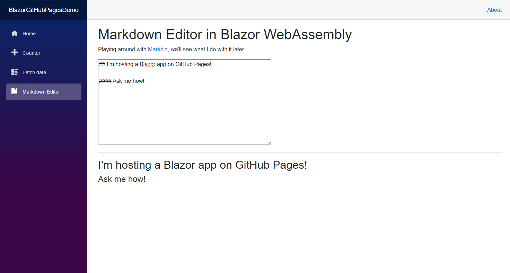

# How to README

### Author:

---

## 1. What is a README?

- A text file meant to be read prior to viewing the content that introduces and explains the project!

- So we can view the README first, best practice is to put the file in the top level directory of the project.

- These should be written in a plain and easy to understand format so everyone can understand what your project is and does.

- The file type is a .md, meaning it's a markdown file! It has it's own [Markdown](https://www.markdownguide.org/) syntax.

## 2. Markdown Basics

Markdown is considered a **markup language**. It makes use of easy-to-type symbols to allow basic formatting of text without the need for a formatting GUI such as the toolbar of Microsoft Word or Google Docs.

Markdown can be written in any text editor and will appear as plain text, but if you pass it in to a [Markdown parser](https://markdown-it.github.io/), you'll get formatted text!

## 3. What goes in a README?

Typically, a `README` will contain the following things:

1. Project Name

   - What is your project called?

2. Description

   - What does your project do?

3. Tools, packages, and installation process

   - What language, packages, and installation steps does your project use?

4. Usage and Features

   - What is awesome about your app and how is it used?

Some other things to consider including in your README:

- Who the authors are

- How the project is [licensed](https://choosealicense.com/)

- A demonstration of the product. This might include:

  - Code examples:

  ```js
  let c = a + b;
  ```

  - Images of the product:
    

  - A [link to a live demo](https://tenaciousdev.github.io/BlazorGitHubPagesDemo/markdowneditor)

## 4. When should I include a README in my project?

A `README` should be included when you think anyone else might be looking at your project! For EFA assignments, that might mean once you've met the criteria to turn in an assignment. In a production environment, it might mean once you've completed enough of a project that you're ready to release it internally and ask for feedback.

## 5. Additional resources

README links: [Make a README](https://www.makeareadme.com/) | [The Art of README](https://github.com/hackergrrl/art-of-readme)

Markdown links: [Why Use Markdown?](https://blog.bit.ai/what-is-markdown/) | [Markdown Cheat Sheet](https://www.markdownguide.org/cheat-sheet/) | [Mastering Markdown GitHub Guide](https://guides.github.com/features/mastering-markdown/) | [GitHub-flavored Markdown](https://github.github.com/gfm/)
